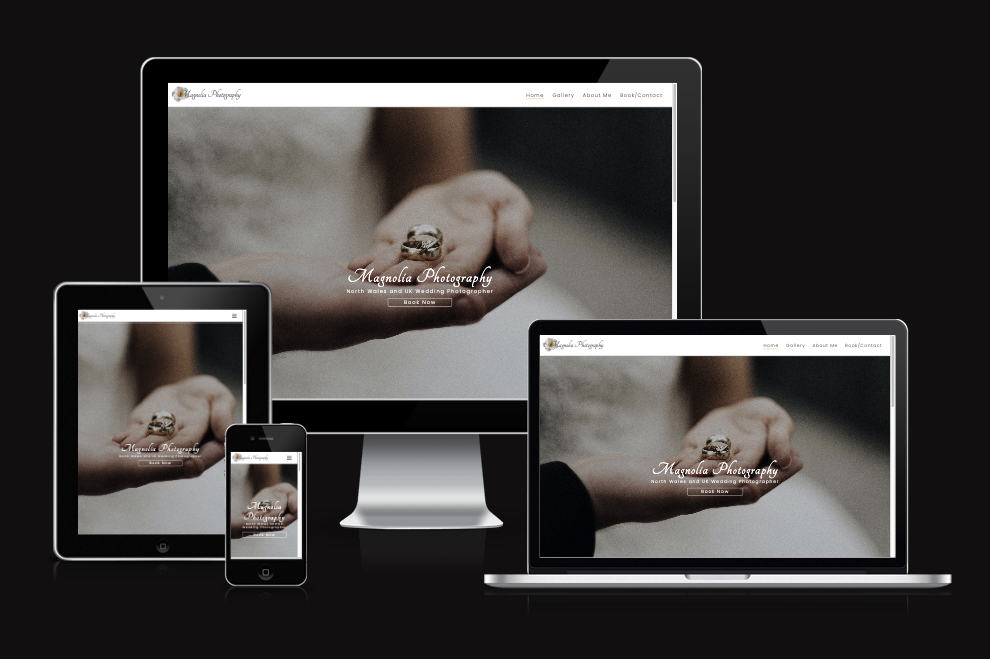
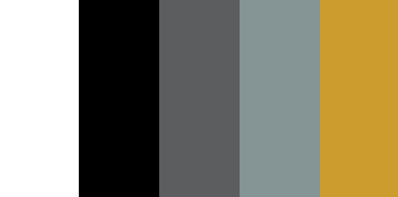
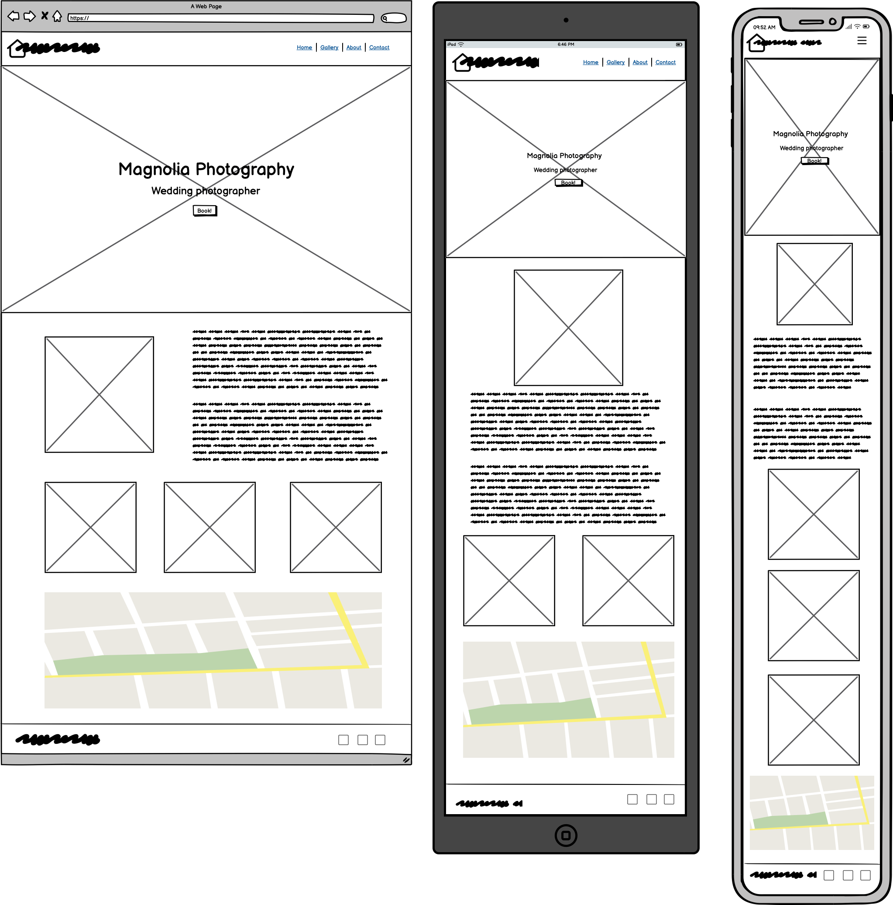
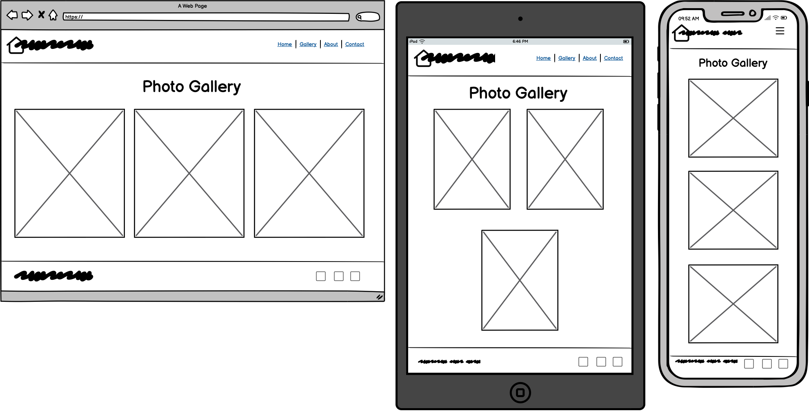
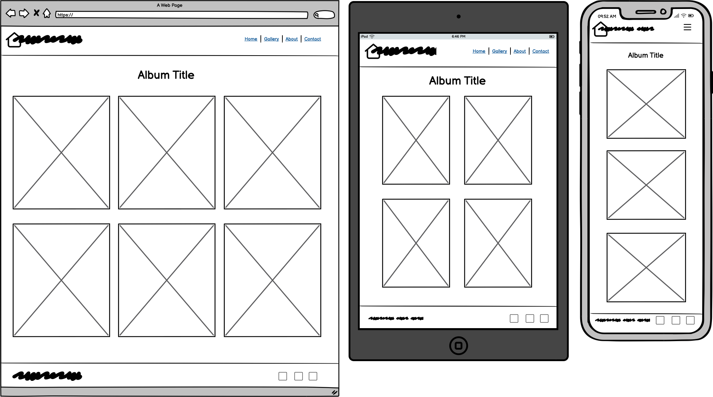
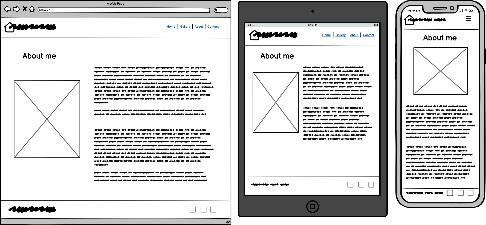
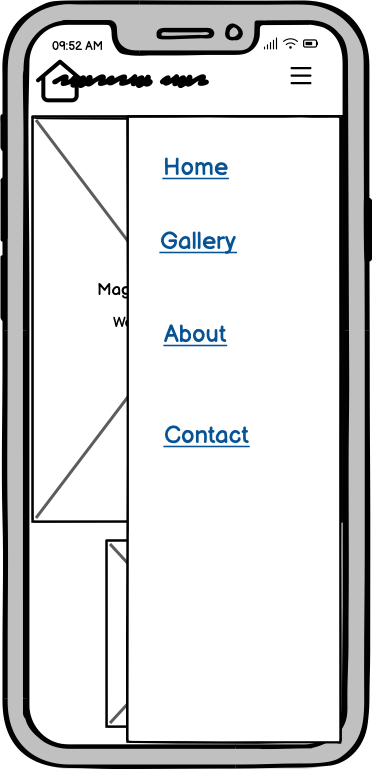

Use:
Images, links, formatting for presentation

Needs:
UX/UI section, links to wireframes, bugs and fixes, credits, deployment, testing (expectations, process, results, fixes)

	LAYOUT IN LOGICAL ORDER

# Magnolia Photography - Portfolio Project

A website advertising a wedding photographer, where visitors come to help them decide who they want to capture the moment of their big day. This website is designed to be responsive across a range of devices and screen sizes and should be welcoming show good examples of the photographers work in order to gain new clients.

Please not this is not a real photographer but a project created for [The Code Institue](https://codeinstitute.net/) as part of their online course.

The live site can be viewed on [here](https://) on github pages

Contents section

_____________________________

## User experience

### User story

As a first time user I want to:

* See what service is on offer.
* Navigate easily through the website.
* See examples of the photographers work.
* See if the photographer is right for me.
* Contact the photographer.

As a returning user I want to:

* Book or contact the photographer.

Due to the nature of the service visitors will unlikely return multiple times other than to book the service or enquire.

_____________________________

## Design

### Colours

I wanted to keep a simple colour scheme to keep the photographs the center of attention, with the majority of the photographs being on the gallery and album pages I used the colour scheme throughout for consistency. I used white for the main colour due to its association with weddings, grey for the main font colour for a softer look, gold/yellow for hover effects as I felt it suited the wedding theme and the green for a splash of colour so it didn't look too plain.

### Typography

Fonts were taken from [Google Fonts](https://fonts.google.com/). I used [Poppins](https://fonts.google.com/specimen/Poppins?query=poppins) as the main font for its clean, modern look and [Tangerine](https://fonts.google.com/?query=tangerine) for headings to add some elegance with sans serif and cursive, respectively, for back up.

### Media

The photographs in the gallery and album pages were taken from [pexels.com](https://www.pexels.com/) a free stock photography site. The "reviewers" are friends and family and the photographer is a portarait of myself.

### Wireframes

The site was designed to be a multi page site which is responsive across all device types.
I made a some design choices during the development process which deviate from the original designs.

#### Index/home page

#### Gallery and Album pages

#### About Page

#### Contact/Booking page

#### Pop out Side Navigation

_____________________________

Features/ Pages

	Header
	Home
	Gallery
	About photographer
	Booking form/contact page

_____________________________

Technologies

	Languages used
	Librarys
	Programs

_____________________________

Testing

	Expectations?
	Browser compatibility
	Lighthouse (performance testing)
	Validators
	Testing sources -	am I responsive
				validation services
	Site functionality
	Bugs - known issues
		Solved issues
		Unsolved issues (hopefully not)

_____________________________

Deployment Instructions

_____________________________

Credits section

	Alan and his work
	Previous exp.
	Libraries
	Tutorials - 	sites
			videos
	Media
	Bootstrap
	Icons
	Fonts
	Me
	Friend/family helped with testing/feedback

Tutorials:

Image cropping - https://www.digitalocean.com/community/tutorials/css-cropping-images-object-fit
	