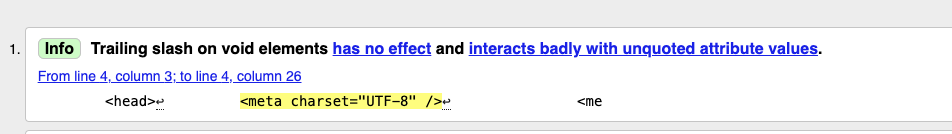

## User Story

### First time user

#### What is this website for?

* Upon entering the website users are greeted with the hero section with an image that shows the theme of the site.
* Overlayed on the image is the company name and a subtitle saying what the company does.
* Scrolling down the page the next section has a more detailed decription of the service on offer.
* The next section has some reviews of other people that have used this service.

#### Navigation

* Across the top of each page is a fixed navigation menu with the current page highlighted.
* Hover effects were added to links to try and help the user understand something will happen when clicked.
* In the album pages links back to the main gallery page were added at the bottom of the page assuming that is where the users eyes would end up after looking through the images.
* External links open in a new browser tab.

#### Can I see examples of the service?

* There is a photo gallery demonstrating the work of the photgrapher split into four 'albums' showing different clients.

#### Who is offering this service?

* There is an about page introducing the photographer which explains the passion for his work.

#### How do I contact the photographer?

* Finally theres is a page dedicated to enquiring about or booking the service on offer.
* There is a form the user can fill out which sends an email to the photgrapher with the details.
* The user can also email or phone the photographer directly with links which open the users mail app or call dialog box.

### Returning user

#### Booking

* The hero section contains a link to the booking/contact page.
* There is another link to the booking/contact page under the reviews section.
* Across the top of each page is the fixed navigation bar with a link to the booking/contact page.

## Validation/Perfomance

tested using [w3.org](https://validator.w3.org/) validator and [Lighthouse](https://chromewebstore.google.com/detail/lighthouse/blipmdconlkpinefehnmjammfjpmpbjk) for Chrome.

### HTML Validation

All tests for each page ran with no errors.\
The validator returned a few warnings about using the h1 element.
 
 There was also "info" regarding the trailing slash on void elements, which was added automatically by the prettier extension in VS code.
 

 ### CSS Validation

Test ran with no errors or warnings.

 ### Performance

 Some performance scores on the image heavy pages were initially low so I optimised the image sizes and convert to the webp format.
 
 
 
 
 
 
 
 

## Manual Testing

### Features

#### Index/header/footer

* logo - takes user to index.html.
* Navbar - Home, Gallery, About, Contact take user to respective pages.
* book buttons - take user to contact.html.
* Footer - Social media link - open in new tab on their respective pages.
* Content appears as intended.
* Hover effects work as intended.
* On smaller screens hamburger icon opens nav menu.

#### Gallery/Album

* Each album cover takes user to correct album.
* Back to Gallery - link takes user back to gallery page.
* Content appears as intended.
* Hover effects work as intended.

#### About

* Content appears as intended.

#### Contact

* Submit and Reset buttons work as intended.
* Form data sent to email see [previews.md](previews.md)
* Content appears as intended
* Hover effects work as intended.

## Responsive

Tested on iPhone 12 mini and iPad pro using google chrome.\
For images see [previews.md](previews.md).

## Cross Browser Support

Tested on Google Chrome, Opera, Firefox, Safari and Microsoft Edge.\

* Content appears as intended.
* Features work as expected.
* Hover effects work as intended.

## Bugs

* When first testing the site on smaller screens there were two problems with the pop-out navigation:
	1. The hamburger button needed pressing twice to initially open the navigation menu.
	2. While using the Chrome Dev tools and closing the navigation pop out, after switching back to a desktop size screen the menu would remain hidden. Although this would unlikely be a real use issue it meant the navigation was not working as intended.
I concluded there was a problem with the JavaScript code I had used. After some research I decided to just use a differnt code which seemed more efficient and suitable for my use case (link provided in credits section).

* While performing the cross browser test I noticed the form input boxes on Safari were styled differently, probably due to Safari's default styling. To keep the style consistant across browsers I added a border to the input box in my CSS code.

* When designing the index page the footer worked as expected and sat at the bottom of the page but on pages with less content the footer would sit undernieth the content not at the bottom. I found a tutorial (link in credits) that involved wrapping the page content in a container which allowed the footer to stay at the bottom of the page.

* Also, when testing for smaller screens on my computer the smaller text in the footer looked fine but when testing on an actual mobile device the text became too small and unreadable, I solved this by stacking the footer elements upon one another allowing me to increase the font size.